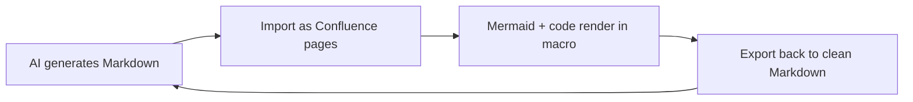

# The AI Era Runs on Markdown. Confluence Doesn't. Here's the Bridge.

**Every LLM reads, writes, and thinks in Markdown. Confluence stores everything in a verbose proprietary XHTML format. Markdown Toolkit makes Confluence speak Markdown in both directions — so AI can write your pages, your diagrams render natively, and your knowledge comes back out in the format models actually want.**

---

Open any AI assistant, type a question, and watch what comes back. Headings. Bullet lists. Fenced code blocks. Tables with pipes. The occasional Mermaid diagram. It is all Markdown, every time, because Markdown is the native tongue of the generation of tools that now write most of our first drafts.

This is not an accident. LLMs were trained on oceans of Markdown — GitHub READMEs, docs sites, Stack Overflow, technical blogs. They emit Markdown by default, parse it reliably, and reason more accurately when their input is structured Markdown rather than tag soup. Markdown is also the lingua franca of docs-as-code, of modern developer tooling, of every "copy as Markdown" button shipping in 2026. If your knowledge is going to participate in an AI workflow, it has to be able to enter and exit as Markdown.

Confluence, by contrast, stores everything in its XHTML-based "storage format" — a proprietary XML dialect stuffed with Confluence-specific `ac:` and `ri:` namespaces for macros, layouts, and resource links. It is verbose, it is non-standard, and it is the near-opposite of what an AI workflow wants on either end. Your most valuable institutional knowledge lives in the one format your AI stack can't comfortably read or produce.

**Markdown Toolkit for Confluence** closes that gap. It teaches Confluence to speak Markdown in both directions — import and export — which turns out to be exactly the shape an AI workflow needs.

---

## 1. Let AI publish straight to Confluence

The first half of the loop: an LLM or agent produces Markdown, and Markdown Toolkit turns it into real Confluence pages. No copy-paste, no manual reformatting, no fighting the rich-text editor to recreate a structure the model already gave you cleanly.

You hand it Markdown two ways:

- **Single page** — one `.md` file becomes one Confluence page in the target space, optionally nested under a parent page you choose.
- **Bulk / tree** — a ZIP archive with a folder hierarchy is imported as a page tree. Files are sorted by path depth so parents are created first, then children are linked into the right parent-child relationships, optionally anchored under a parent page. An AI that generates a whole documentation set — folders and all — gets published as a structured space, not a pile of orphan pages.

The conversion is real GitHub-Flavored Markdown to Confluence storage XHTML, not a lowest-common-denominator paste:

- Headings `#` through `######` map to `<h1>`–`<h6>`.
- Inline `**bold**`, `*italic*`, `~~strikethrough~~`, and `` `code` `` convert faithfully.
- Ordered and unordered lists (with continuation lines and nesting), GFM pipe tables (with `<thead>`/`<tbody>`), links, and images all carry across.
- Internal `.md` references are detected by extension and re-linked by page title, so a cross-linked doc set stays cross-linked inside Confluence.
- Fenced code blocks with a language tag become the Confluence `code` macro with the language preserved.
- GFM alerts — `> [!NOTE]`, `> [!TIP]`, `> [!WARNING]`, `> [!CAUTION]`, `> [!IMPORTANT]` — become the matching Confluence `info`, `tip`, `warning`, and `error` macros.
- `<details>`/`<summary>` blocks become the Confluence `expand` macro; horizontal rules, blockquotes, and proper XML escaping are all handled.

The practical version: your AI writes the runbook, the architecture doc, the release notes. Markdown Toolkit publishes it. The reformatting tax that used to sit between "the model finished" and "the page is live" disappears.

---

## 2. Mermaid and code render natively in the page

The second piece is the `markdown-renderer` macro — a live Markdown surface you drop into any Confluence page. It renders full Markdown with formatting, syntax highlighting, and diagrams right where the content lives.

Under the hood it runs markdown-it (CommonMark plus GFM) for parsing, highlight.js for syntax highlighting across 100+ languages, and KaTeX for LaTeX math in both `$inline$` and `$$display$$` form. Task-list checkboxes, Confluence emoticons, and properly styled tables all come along for the ride, and GFM alerts render as styled cards with icons and colored borders.

The part that matters most for AI workflows is **Mermaid**. AI assistants love emitting Mermaid — it is how they draw architecture, flowcharts, sequence diagrams, state machines, ER diagrams, Gantt charts, and more. The macro detects a ```` ```mermaid ```` fence and renders it as an interactive SVG, themed to match Confluence (Jira blue `#0052CC`, light backgrounds, neutral strokes), auto-scaled to avoid clipping and responsive on wide diagrams.

That removes a whole annoying step. Today, getting an AI-generated diagram into Confluence usually means exporting a PNG from some external tool and pasting a screenshot that goes stale the moment the design changes. With the renderer, the diagram *is* the Markdown. Ask the model to update the flow, drop the new fence in, and the picture updates itself — no screenshots, no external editor, no drift.



---

## 3. Export to Markdown: fewer tokens, AI-ready knowledge

The other half of the loop is getting knowledge back *out* in a form your AI stack can actually use. Markdown Toolkit exports a single page, a page tree with all its descendants, a bulk multi-select, or an entire space to clean GFM Markdown — a faithful round-trip of the import.

The conversion runs the storage format backward into Markdown: headings, inline styles, links (Confluence `ac:link`/`ri:page` page references resolved to titles, external hrefs, attachment refs), images, nested lists, pipe tables with alignment, and code/`noformat` macros all map to standard Markdown. Confluence panels and macros come back as their natural Markdown equivalents — `info`/`note` to `> [!NOTE]`, `tip`/`success` to `> [!TIP]`, `warning` to `> [!WARNING]`, `error` to `> [!CAUTION]`, `expand` to `<details>`, `toc` to `[TOC]`, `status` to inline code, with unsupported macros preserved as labeled HTML comments rather than silently dropped. Layout sections flatten into sequential content with dividers, attachments can be bundled, and exports arrive as a ZIP with a manifest and an optional generated index. File names are normalized and de-conflicted so the output is clean on any filesystem.

Here is why that export is the AI payoff, not just a convenience. **Markdown is dramatically lighter than Confluence storage XHTML** — and that is an inherent property of the formats, not a marketing claim. The same simple note looks like this in storage format:

```xml
<ac:structured-macro ac:name="info">
  <ac:rich-text-body>
    <p>Rotate the API key <strong>before</strong> every release.</p>
  </ac:rich-text-body>
</ac:structured-macro>
```

And like this in Markdown:

```markdown
> [!NOTE]
> Rotate the API key **before** every release.
```

Same meaning. A fraction of the characters, and none of the namespaced tags. Because LLMs tokenize text, all those `<ac:...>` and `<ri:...>` tags are tokens the model has to pay for and read around. Strip them down to Markdown and the same knowledge becomes **fewer tokens** — cheaper to feed into a context window, cheaper to embed, and easier for the model to read accurately. Whether you are loading docs into a context window, building a RAG pipeline, or grounding an internal AI assistant, exporting to Markdown gives you the leanest, most model-legible version of your knowledge instead of forcing the LLM to wade through XHTML it was never meant to parse.

---

## Confluence becomes part of your AI stack

Put the three pieces together and Markdown Toolkit stops being a format converter and becomes a bridge. AI writes the doc and it publishes as a real page. The diagrams the model emits render natively, no screenshots. And when you need that knowledge back, it comes out as lean Markdown your models can read cheaply and accurately. Confluence stays the place your whole company already reads and collaborates — and finally sits inside the AI workflow instead of beside it.

It runs on Atlassian Forge, which means it runs inside your own Atlassian tenant. No content is shipped to an external service to be converted; the import, the rendering, and the export all happen within Atlassian's infrastructure, so your knowledge stays where it already lives. The bridge to your AI workflow doesn't come at the cost of where your data sits.

The AI era runs on Markdown. Now your Confluence can too.
