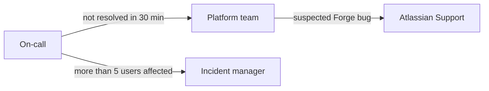

# The AI Era Runs on Markdown. Your Confluence Is Written in Something Else.

**Every LLM reads, writes, and thinks in Markdown. Confluence stores everything in a verbose proprietary XHTML format. Markdown Toolkit renders Markdown — diagrams, maths and highlighted code — inside a Confluence page, and gets your knowledge back out in the format models actually want.**

---

Open any AI assistant, type a question, and watch what comes back. Headings. Bullet lists. Fenced code blocks. Tables with pipes. The occasional Mermaid diagram. It is all Markdown, every time, because Markdown is the native tongue of the generation of tools that now write most of our first drafts.

This is not an accident. LLMs were trained on oceans of Markdown — GitHub READMEs, docs sites, Stack Overflow, technical blogs. They emit Markdown by default, parse it reliably, and reason more accurately when their input is structured Markdown rather than tag soup. Markdown is also the lingua franca of docs-as-code, of modern developer tooling, of every "copy as Markdown" button shipping in 2026.

Confluence, by contrast, stores everything in its XHTML-based "storage format" — a proprietary XML dialect stuffed with Confluence-specific `ac:` and `ri:` namespaces for macros, layouts, and resource links. It is verbose, it is non-standard, and it is the near-opposite of what an AI workflow wants. Your most valuable institutional knowledge lives in the one format your AI stack can't comfortably read.

**Markdown Toolkit for Confluence** closes that gap from both ends of the page: Markdown renders *in* the page as Markdown, and the page comes *out* as Markdown.

---

## 1. Markdown renders where the content lives

The first piece is the `markdown-renderer` macro — a live Markdown surface you drop into any Confluence page with `/Markdown`. Paste Markdown in, and the page renders it: formatting, tables, task lists, GFM alerts as coloured panels, syntax highlighting across 100+ languages via highlight.js, and LaTeX maths in both `$inline$` and `$$display$$` form via KaTeX.

The part that matters most for AI workflows is **Mermaid**. AI assistants love emitting Mermaid — it is how they draw architecture, flowcharts, sequence diagrams, state machines, ER diagrams, Gantt charts, and more. The macro detects a ```` ```mermaid ```` fence and renders it as an SVG, themed to match Confluence in both light and dark mode, sized so a wide diagram scrolls in its block instead of shrinking until the labels are unreadable.

Twenty-one diagram types render, from the everyday flowchart to Sankey diagrams, radar charts, kanban boards and C4 context diagrams. This is the whole of it:

````markdown

````

That removes a whole annoying step. Today, getting an AI-generated diagram into Confluence usually means exporting a PNG from some external tool and pasting a screenshot that goes stale the moment the design changes. With the renderer, the diagram *is* the Markdown. Ask the model to update the flow, drop the new fence in, and the picture updates itself — no screenshots, no external editor, no drift.

It also changes who can fix it. A diagram written as six lines of text is editable by anyone who can edit the paragraph above it. A diagram exported as a PNG needs the tool that made it, and that tool is usually on somebody's old laptop.

The practical version: a whole architecture note, a postmortem, or a runbook — prose, tables, code and diagrams together — lives in one Confluence page, in the same format the model wrote it in. Nothing is reformatted into the rich-text editor and nothing is split across two tools.

---

## 2. Export to Markdown: fewer tokens, AI-ready knowledge

The other half is getting knowledge back *out* in a form your AI stack can actually use. Markdown Toolkit exports a single page, a page tree with all its descendants, a bulk multi-select, or an entire space to clean GFM Markdown.

The conversion runs the storage format backward into Markdown: headings, inline styles, links (Confluence `ac:link`/`ri:page` page references resolved to titles, external hrefs, attachment refs), images, nested lists, pipe tables with alignment, and code/`noformat` macros all map to standard Markdown. Confluence panels come back as their natural Markdown equivalents — `info`/`note` to `> [!NOTE]`, `tip`/`success` to `> [!TIP]`, `warning` to `> [!WARNING]`, `error` to `> [!CAUTION]`, `expand` to `<details>`, `toc` to `[TOC]`, `status` to inline code — with unsupported macros preserved as labelled HTML comments rather than silently dropped. Layout sections flatten into sequential content with dividers, attachments can be bundled, and exports arrive as a ZIP with a manifest and an optional generated index. File names are normalised and de-conflicted so the output is clean on any filesystem.

Here is why that export is the AI payoff, not just a convenience. **Markdown is dramatically lighter than Confluence storage XHTML** — and that is an inherent property of the formats, not a marketing claim. The same simple note looks like this in storage format:

```xml
<ac:structured-macro ac:name="info">
  <ac:rich-text-body>
    <p>Rotate the API key <strong>before</strong> every release.</p>
  </ac:rich-text-body>
</ac:structured-macro>
```

And like this in Markdown:

```markdown
> [!NOTE]
> Rotate the API key **before** every release.
```

Same meaning. A fraction of the characters, and none of the namespaced tags. Because LLMs tokenize text, all those `<ac:...>` and `<ri:...>` tags are tokens the model has to pay for and read around. Strip them down to Markdown and the same knowledge becomes **fewer tokens** — cheaper to feed into a context window, cheaper to embed, and easier for the model to read accurately. Whether you are loading docs into a context window, building a RAG pipeline, or grounding an internal AI assistant, exporting to Markdown gives you the leanest, most model-legible version of your knowledge instead of forcing the LLM to wade through XHTML it was never meant to parse.

---

## 3. It reads. It does not write.

Worth saying plainly, because it is the question every security review asks first: Markdown Toolkit requests **no write permission of any kind**. It cannot create, edit or delete a page, a comment or an attachment. It reads what you can already read, converts it, and hands you a file.

That is a deliberate boundary, not a missing feature. An app that can rewrite your knowledge base is an app that has to be trusted with your knowledge base. This one cannot change a single page, which makes the review conversation short.

It runs on Atlassian Forge, so it runs inside your own Atlassian tenant. No content is shipped to an external service to be converted; the rendering and the export both happen within Atlassian's infrastructure, and the app declares no external network access at all. Your knowledge stays where it already lives.

---

## Confluence becomes part of your AI stack

Put the two pieces together and Markdown Toolkit stops being a format converter and becomes a bridge. The Markdown your models emit — diagrams and maths included — renders natively on the page, no screenshots and no reformatting tax. And when you need that knowledge back, it comes out as lean Markdown your models can read cheaply and accurately.

Confluence stays the place your whole company already reads and collaborates — and finally sits inside the AI workflow instead of beside it.

The AI era runs on Markdown. Now your Confluence can too.
